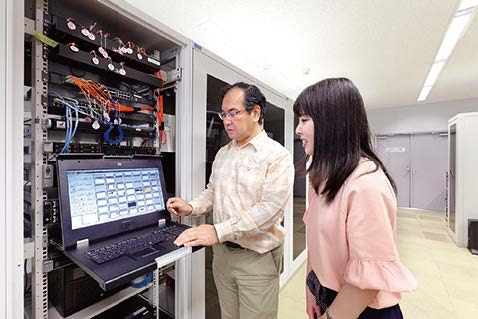

# 情報工学科の紹介
<!-- Markdown記法を使って学科の紹介ページを作る -->

<!-- この部分より上に記述を追加して下のチェックボックスで確認する -->

情報工学科とは？

情報化社会をさらに進化させる、IT業界の新たなリーダーを育成。

高度情報化が進展している現代社会において、ITを利活用できる知識や技能は必要不可欠です。
情報工学科では、基礎スキルから高度なスキルを段階的に学べるプログラミング教育、進路を見据えた幅広いコース選択によって着実な知識を身につけ、卒業研究によって、主体性、課題に対する洞察力、解決のためのコミュニケーション能力等、実社会に役立つ総合的能力を修得します。

システムエンジニアリングコース
プログラミングによって時代の求める新しい情報システムを作る

プログラミングを基礎から学び、自在にコンピュータを制御するソフトウェアや情報システムの設計技術を修得していきます。モバイルシステムのような身近なものから“富岳”のようなスーパーコンピュータを使う大規模かつ高度なものまで、時代に必要とされる情報システムを創造するエンジニアを育成します。

インターネット＆セキュリティコース

安全で安心できる持続的な情報社会を支えるネットワークとセキュリティを学ぶ

昨今の情報化社会は、私たちの暮らしをとても豊かなものにしてきましたが、その一方で、これまでにはみられなかった様々な脅威が発生しています。それらから私たちの暮らしを守り、安全で安心できる情報社会を構築するために、ネットワーク技術や情報セキュリティ対策などについて学びます。

知能情報コース
「モノ」と「コト」の未来へAIの先を拓く

あらゆるモノがネットワークに繋がるIoT、さまざまなコトに繋げるビッグデータ解析や人工知能は、既に私たち人間にとって日常の一部になっています。これらの知識・技術を基礎から応用まで学び、目覚しく変化する情報社会の新しい今後を創り出す専門家の育成を目指します。

拓殖大学　工学科　ホームページ
https://feng.takushoku-u.ac.jp/course/cs/introduction.html
